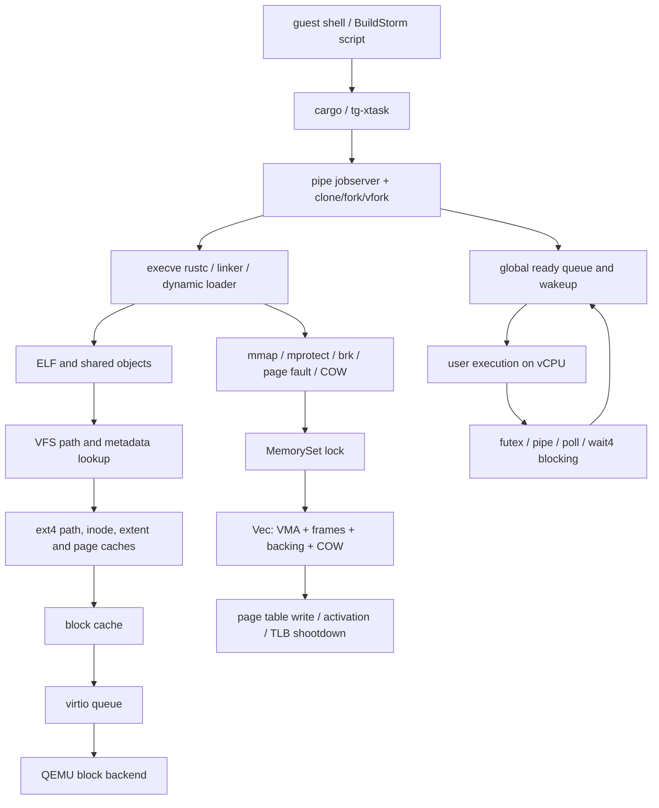

# BuildStorm 全局编译路径与根因审计报告

日期：2026-08-07
分支：`wbq_final_buildstorm_compile`
审计基线：保留 range-local `mprotect` 修复，不包含任何已拒绝候选

> **BuildStorm full compile: unverified / not completed**

本报告是本轮第一份交付。它只整理已保存的官方长跑、
production 短窗口、feature-gated 诊断窗口、独立回归和当前源码调用路径。
本报告不新增 production 优化，不修改官方镜像、guest 脚本、judge、
marker 或 guest 时间。

## 1. 执行结论

1. 已验证的端到端吞吐边界不是 panic、OOM、宿主 swap、设备饱和或
   单 QEMU 线程。15,000 秒内编译持续前进，但仅到达 33 个
   `Compiling` 事件。
2. 1,800 秒窗口最大观测到 **2 个存活 rustc 进程**、**20 个 rustc TCB**，
   其中最多 **9 个 runnable TCB**；final 为 2 个 process、17/8 个 live/runnable
   TCB。进程 leader 的 runnable 字段不能代表其 worker，不能据此判定 Cargo
   或调度器把 rustc 串行化。
3. Cargo 可见 8 CPU，jobserver pipe 正常传输，CLOEXEC 正常关闭，wake-to-run
   延迟较小，三个调度/pipe production 候选的进度改善均为 0%。这些证据把
   调度器/pipe 从第一生产候选降级，但不把 Cargo 内部阶段误判为内核问题。
4. 保留 `mprotect` 修复后，最大的已测内核工作类是页错。300.063 秒 marker
   差分中，load/store/exec page fault 累计约 **95.05 秒**。其中匿名驻留
   窗口安装约 **62.72 秒**，全量 VMA coalesce 约 **59.64 秒**。
5. `Vec<MapArea>` 同时表示逻辑 VMA、驻留 frame、backing 和 COW，导致安装
   8-page 匿名驻留窗口必须 split/insert/coalesce VMA。这是已证明的结构性
   成本耦合；缺一个匿名页在语义上**没有必要**修改逻辑 VMA 拓扑。
6. VFS 仍有次级 CPU 成本：marker 差分中 `openat` 约 23.02 秒，`statx`
   约 19.98 秒。但 block-cache 命中率约 94.3%，virtio completion 仅约
   0.98 秒，真正 block-I/O 阻塞约 2.42 秒，ext4/VFS/block-cache 等待也很小。
   因此不支持“块设备慢”或“ ext4 全局锁是第一根因”。
7. 目前不授权调度器、VFS、MM 和块缓存联合重构。如果进入结构性修改，
   **唯一推荐的设计方向**是 MM 内将逻辑 VMA 与页级 resident/frame/COW
   状态分离。后半程诊断已经证实 anonymous coalesce 在第 200 秒后仍消耗
   420.886 秒；实现必须先遵守第 15 节和独立设计文件的验证门。

## 2. 基线冻结与来源

### 2.1 当前状态

| 项目 | 已验证值 | 结论 |
| --- | --- | --- |
| 本地 HEAD | `4a6bee263fbf0dd3faad7fc89ad4df7b89e7f2da` | 已推送 GitLab |
| 本地分支 | `wbq_final_buildstorm_compile` | 正确 |
| 本地 dirty diff SHA-256 | `b72ddd9cd928dc56dfb0346e45f89ad1326c11ca2a92896225c4c13217cbf1a9` | 只包含用户未提交删除；大量 evidence 为 untracked |
| 远程工作树 HEAD | `4d6f10506d1bff10bb07e0f569daa86362459566` | 仍是旧 HEAD + dirty 开发树 |
| 远程 dirty diff SHA-256 | `24c47d320b527d3b494bd2930f702ae60a4172b9680777410dba9d0e782e454c` | 不是冻结提交态 |
| 当前 GitLab 分支 | `4a6bee263fbf0dd3faad7fc89ad4df7b89e7f2da` | 远程已 fetch，但未覆盖 dirty 工作树 |
| `memory_set.rs` SHA-256 | `622bbbac2a1a7165609d140ee09fb0a0a0da81e51fe5d5b364d753ecad1df59b` | 精确匹配保留 `mprotect` 基线 |
| 远程 QEMU | 无 `qemu-system-*` 进程 | 本审计未启动新实验 |
| QEMU | `QEMU emulator version 11.0.3` | 与保存证据一致 |
| RISC-V64 image | `d74e436522f5946ca17280a7a25f17dbb6604b71fe675bb8a021ce8e849b334c` | 官方镜像 |
| LoongArch64 image | `d1410544e677e11efb1c240be6ffb201c89d6de58c9675e73314a696e4cefdc5` | 官方镜像 |
| 官方 suite HEAD | `b5ec6ef8497e1818cbdec3b54bb722f036e57972` / `final-2026` | 本地 suite clean；2026-08-07 refresh 因 GitHub TLS 中断失败，不声称已确认更新提交 |

远程工作树尚未冻结到 `4a6bee2` 的逐文件状态。在同步前，不应在
`/srv/buildstorm/src/wll_os` 上叠加新候选。这不影响本报告对已保存证据的
只读分析。

### 2.2 官方长跑身份

| 项目 | 值 |
| --- | --- |
| 运行目录 | `docs/evidence/buildstorm-stage2/20260806-riscv64-production-mprotect-range-coalesce-15000-official/` |
| 源 commit + dirty diff | `4d6f105...` + 该目录的 `kernel-source-dirty.diff` |
| kernel SHA-256 | `90b202ab13226a9b15d47001a663c28e66c156b82e6b5f2b17a48c9709643ffb` |
| image SHA-256 | `d74e436522f5946ca17280a7a25f17dbb6604b71fe675bb8a021ce8e849b334c` |
| suite commit | `b5ec6ef8497e1818cbdec3b54bb722f036e57972` |
| QEMU 参数 | `-snapshot -kernel .../wll_OS -m 8G -smp 8 -display none -monitor none -serial stdio -drive file=.../sdcard-rv-pub.img,if=none,format=raw,id=x0 -no-reboot -machine virt -bios default -device virtio-blk-device,drive=x0,bus=virtio-mmio-bus.0` |
| host elapsed | `15000.071406268005 s` |
| official judge | toolchain 8 + minibuild 12 = **20.0 scripted points**；compile marker missing |

### 2.3 证据等级

| 结论 | 等级 | 说明 |
| --- | --- | --- |
| toolchain / minibuild 成功 | `official-pass` | 未修改镜像和官方脚本，有精确成功 marker 和 judge 输出 |
| full compile | `unverified` | 无 `BUILDSTORM_COMPILE mode=multi ok=true` |
| 1 核 / 8 核 production 短窗口 | `unverified` | 可比性能证据，但无编译成功 marker |
| feature-gated 诊断窗口 | `unverified` | 只用于归因，不用于评分 |
| 双架构 release / SMP regression | `capability-pass` | 独立构建和 SMP/TLB/ASID 回归成功 |

## 3. 完整调用路径模型



### 3.1 进程生命周期

| 阶段 | 实际入口 | 锁/数据 | 主要复杂度与风险 |
| --- | --- | --- | --- |
| clone/fork/vfork | `os/src/syscall/process.rs:1120` `sys_clone()` | parent `memory_set`、`inner`、fd table、fs/mm/signal state | `fork_cow()` 遍历所有 VMA 和 resident frames；约 `O(V + R)` |
| COW 建立 | `os/src/mm/memory_set.rs:1186` `fork_cow()` | `MemorySet.areas` + page table | 私有映射标 COW，共享 `FrameTracker`，重映射叶 PTE |
| execve | `os/src/syscall/process.rs:548` | fs context、fd table、MemorySet、trap frame | 读 ELF/动态链接器，新建 MemorySet，关闭 CLOEXEC fd，最后替换地址空间 |
| ELF / interpreter | `os/src/mm/elf_loader.rs` + `sys_execve()` | file/image cache、new MemorySet | 按 PT_LOAD 创建映射；动态链接器产生额外 VFS/MM 工作 |
| fd / jobserver 继承 | `sys_clone()` 中 `dup_fd_table()`；`sys_execve()` 中 `close_on_exec()` | `TaskControlBlockInner.fd_table` | 有效诊断观测 143 `pipe2`、137 CLOEXEC，继承的 CLOEXEC pipe 端点均被关闭 |
| exit | `os/src/syscall/process.rs:839` | task/thread-group/parent child list | 标 Zombie，通知 parent，释放资源 |
| wait4/waitid | `os/src/syscall/process.rs:962`, `:1031` | child wait queue；注册后重查 | 避免 child-exit lost wakeup；阻塞时长是 task-time，多任务可重叠 |

### 3.2 调度与同步

| 路径 | 实际实现 | 审计结论 |
| --- | --- | --- |
| runnable 入队 | `os/src/task/manager.rs:69` `add_task()` | user/kernel 各一个**全局** `Mutex<ReadyQueue>`，不是 per-CPU ready queue |
| runnable 出队 | `os/src/task/manager.rs:131` `fetch_task()` | 在全局 `VecDeque` 上扫描 affinity/priority；队列短时开销小 |
| wakeup CPU | `manager::add_task()` → `platform::notify_runnable()` | 能唤醒其他 vCPU；已观测所有 vCPU 有 user ticks |
| migration | 任务不绑定单队列，fetch 按 affinity 选择 | marker 窗口共计约 16,737 migrations，不存在“只在 CPU0 运行” |
| blocked syscall | `os/src/task/mod.rs` `block_current_and_run_next()` | foreground 模式保留 blocked-owner continuation，并可在同一 CPU 上调度其他任务 |
| futex | `os/src/syscall/other.rs:2050` | wait-key + wait queue；有 wake/timeout/interrupted 聚合计数 |
| pipe | `os/src/syscall/fs.rs:2900` | pipe wait key + fd readiness | pipe 读写和 wake 均持续前进 |
| poll/ppoll/epoll | `os/src/syscall/fs.rs:4404`, `:4167` | keyed readiness wait | 阻塞时长大，但 wake-to-run 延迟小 |

全局 ready-queue 在架构上会限制更高核数扩展，但本窗口的 `task_manager`
锁等待仅约 59 ms，且 production 调度候选无进度改善，所以它不是当前
第一热点。

### 3.3 MM / VMA / COW / TLB

| 对象/路径 | 实际入口 | 数据表示与复杂度 |
| --- | --- | --- |
| `MemorySet` | `os/src/mm/memory_set.rs:160` | `page_table + address_space_id + Vec<MapArea>` |
| `MapArea` | `os/src/mm/map_area.rs:92` | interval + PTE flags + dense `Vec<FrameTracker>` + backing |
| mmap | `os/src/syscall/mm.rs:479` | 查找空闲区间，插入/merge VMA |
| mprotect | `os/src/syscall/mm.rs:641` | 已保留：只扫描重叠范围并局部 coalesce |
| munmap | `os/src/syscall/mm.rs:665` | shared-file writeback 在 MemorySet 解锁后进行，然后修改映射 |
| brk | `os/src/syscall/mm.rs:403` | 改变 heap VMA 范围 |
| hardware page fault | `os/src/trap/mod.rs:273` → `MemorySet::handle_page_fault()` | 持有每进程 MemorySet spin mutex |
| anonymous demand | `os/src/mm/memory_set.rs:779` | 8-page frame 窗口，然后 split 两次、`Vec::insert`、map、全量 coalesce |
| split | `os/src/mm/memory_set.rs:1058` | `Vec::insert(index + 1)`，最坏 `O(V)` 搬移 |
| global coalesce | `os/src/mm/memory_set.rs:1107` | sort `O(V log V)` + 重建/搬移 `O(V + R)` |
| COW fault | `os/src/mm/memory_set.rs:586` | 分割 area，复制共享 frame，重映射后 coalesce |
| fork COW | `os/src/mm/memory_set.rs:1186` | 遍历 VMA 和 resident frames，共享或复制 |
| root activation | `MemorySet::activate()` / polyhal page table | 发布 root/ASID，写 `satp`/等价寄存器 |
| shootdown | `platform::tlb_shootdown()` | 映射修改后跨 CPU 失效 |

#### 关键不变量

1. `areas` 按 start address 排序且不重叠。
2. 一个 framed `MapArea.frames[i]` 必须对应 `start + i * PAGE_SIZE`。
3. `MapArea` 只能表示“完全不驻留”或从 area start 开始的密集 frame 序列，
   不能在一个逻辑 VMA 内表示驻留洞。
4. 因此匿名缺页必须把逻辑 VMA 切成“未驻留 / 已驻留 / 未驻留”片段。

#### 必须回答的问题

**匿名缺一页或安装一个缺页窗口，在语义上没有必要修改 VMA 拓扑。**

VMA 描述的是区间权限和 backing。页是否已驻留是该 VMA 内的页级状态。
当前实现修改 VMA 拓扑，是因为 `frames` 被嵌入 `MapArea` 且必须密集对应
VMA start，而不是 mmap 语义要求。

### 3.4 VFS / ext4 / cache / virtio

| 阶段 | 实际入口 | 缓存/锁 | 审计结论 |
| --- | --- | --- | --- |
| openat | `os/src/syscall/fs.rs:2194` | task inner + fd table | `resolve_host_path()` 后进入 `fs::open_path()` |
| VFS open | `os/src/fs/vfs.rs:3612` | symlink/parent/directory RwLock caches | 会规范化路径、解析父目录与最终 symlink |
| ext4 lookup | `os/src/fs/ext4_vol.rs:2887` | `PATH_CACHE`、`NEGATIVE_PATH_CACHE`、`DIR_CACHE` | cache miss 时按 component 查目录；命中时 BTreeMap 查询 |
| inode metadata | `INODE_METADATA_CACHE` | RwLock BTreeMap | 存在缓存，但当前诊断 hit/miss 未接线 |
| regular / clean page | `REGULAR_FILE_CACHE`, `CLEAN_PAGE_CACHE` | per-cache Mutex | ELF/只读映射可共享 clean frames |
| extent | `os/src/fs/ext4_vol.rs:955` | `PBLOCK_RUN_CACHE` | 诊断 marker 差分约 0.49 秒 |
| block cache | `os/src/fs/block_dev.rs:18` | 32K block LRU + `io_lock` | 命中率高；miss 最多预读 16 blocks |
| virtio | `os/src/drivers/virtio_mmio_blk.rs:175` | virtio request lock/queue | marker 差分 completion 不到 1 秒 |
| QEMU backend | 官方 raw image + snapshot overlay | host block backend | host iostat 无持续饱和 |

当前可以确定：不是设备等待或 ext4 大锁。仍未能区分 `openat/statx`
时间中有多少是 String/路径规范化、VFS cache 查询、ext4 metadata cache miss 或
用户数据拷贝，因为 inode/metadata hit/miss 计数在现有样本中为未覆盖，
不是真实的“全部 miss”。

## 4. rustc 生命周期时间线

### 4.1 production marker 窗口

| marker 后时间 | 已验证事件 | 解读 |
| ---: | --- | --- |
| 0 s | `BUILDSTORM_BEGIN mode=multi` | 官方计时起点 |
| 18.823 s | `Finished dev` | tg-xtask 自身/配置阶段完成 |
| 18.8–113.1 s | axbuild 配置、prebuild、动态链接器/子 cargo 启动 | 串口尚无主编译 `Compiling` |
| 113.135 s | 首个 timed `Compiling` | `compiler_builtins` 与 `core` 启动 |
| 113.1–123.749 s | 23 个 `Compiling` 事件快速出现 | Cargo 快速发布已满足依赖的任务 |
| 123.749–300 s | 无新 `Compiling` | 已启动 rustc 长时间执行；不能从 Cargo 行区分 front-end/LLVM/link |

原 feature-off 基线的首个 timed crate 是 130.158 s，第 23 个是 139.770 s。
保留 `mprotect` 修复分别为 113.135 s 和 123.749 s，第 23 个提前 11.46%。

### 4.2 十秒聚合时间线

marker 在 snapshot 5 和 6 之间出现。下表为保留 `mprotect` 诊断样本的原始
聚合状态；状态为 `Running` 的进程在某些 process-level 字段中不计为
`runnable`，因此并发结论以已校正的 TCB + TGID 样本为准。

| snapshot / guest time | user TCB live/runnable/blocked | rustc TCB live/runnable | rustc processes live | 事件阶段 |
| --- | ---: | ---: | ---: | --- |
| 5 / 50.174 s | 2 / 1 / 1 | 0 / 0 | 0 | marker 前 |
| 10 / 100.184 s | 14 / 1 / 13 | 0 / 0 | 0 | axbuild/prebuild |
| 15 / 150.202 s | 14 / 1 / 13 | 0 / 0 | 0 | 子 cargo 准备 |
| 20 / 200.209 s | 23 / 2 / 21 | 4 / 1 | 1 | rustc 长执行开始 |
| 25 / 250.216 s | 21 / 1 / 20 | 4 / 1 | 1 | 单 runnable rustc 阶段 |
| 30 / 300.224 s | 21 / 1 / 20 | 4 / 1 | 1 | 单 runnable rustc 阶段 |
| 35 / 350.237 s | 21 / 1 / 20 | 4 / 1 | 1 | 窗口结束前 |

在其他已校正的有效样本中，最大为 3 个存活 rustc 进程、1 个 runnable
rustc 进程；线程级最大为 9 live / 3 runnable。

### 4.3 15,000 秒阶段

| 长跑 | `Compiling` | `Finished` | 末尾 | host CPU | 结果 |
| --- | ---: | ---: | --- | ---: | --- |
| 原 production 基线 | 33 | 2 | `rustc-literal-escaper` | 767% | timeout |
| 保留 `mprotect` 基线 | 33 | 2 | `rustc-literal-escaper` | 766% | timeout |

`mprotect` 修复明显提前了前 23 个任务的发布，但没有改变 15,000 秒的
最终 crate 边界。因此它是真实内核热点，但不是已证明的“唯一完整编译
根因”。

现有串口只记录 Cargo 任务开始，不记录 rustc 内部 front-end、LLVM/codegen、link
和 writeback 边界。因此后半程精确子阶段仍为 `unverified`，不应把
`Compiling` 行间隔直接解释为内核卡住。

## 5. 300.063 秒 marker 差分归因

以 snapshot 5（marker 前）和 snapshot 35 的累计计数做差，对应
`300.062826 s`。这比直接使用从启动开始的 final 累计值更接近官方 marker
窗口。

### 5.1 内核工作类

| 工作类 | 次数差分 | 时间差分 | 备注 |
| --- | ---: | ---: | --- |
| page fault store | 131,963 | 79.127 s | 最大 top-level MM 工作 |
| anonymous install | 121,589 | 62.725 s | 嵌套在 page fault |
| anonymous coalesce | 121,589 | 59.642 s | anonymous install 的 95.1% |
| openat | 20,417 | 23.018 s | VFS 次级热点 |
| statx | 49,589 | 19.985 s | VFS 次级热点 |
| page fault exec | 13,171 | 10.798 s | ELF/可执行页 |
| anonymous allocation | 121,589 | 8.396 s | 显著低于 coalesce |
| page fault load | 7,260 | 5.123 s | 只读/文件页 |
| read | 18,951 | 3.798 s | syscall 级总时间 |
| mmap | 1,644 | 2.541 s | |
| anonymous split | 121,589 | 1.556 s | 未包含后续全量 coalesce |
| mprotect | 54,579 | 1.442 s | 已从旧样本的数十秒级降低 |
| virtio read | 17,385 | 1.385 s | |
| anonymous map | 121,589 | 1.289 s | PTE 安装本身不是主成本 |
| munmap | 495 | 0.934 s | |
| extent lookup | 1,739 | 0.493 s | |
| virtio write | 6,386 | 0.403 s | |
| TLB shootdown scope | 16,134 | 0.299 s | |
| address-space activation | 26,274 | 0.178 s | |

page-fault load/store/exec 总时间约 95.05 秒；`mmap + mprotect + munmap` 约
4.92 秒。这些计时可在不同任务/CPU 上重叠，不能直接相加后当作 wall-time
百分比。

### 5.2 阻塞类别

诊断代码定义 7 个阻塞类，所以不伪造“Top 10”。下表列出全部已定义
类别；`timer` 在该样本未输出非零记录。阻塞时间是 task-time，可在多个进程
之间重叠。

| 排名 | 类别 | 次数差分 | 累计 task-time |
| ---: | --- | ---: | ---: |
| 1 | wait4/waitid | 201 | 386.277 s |
| 2 | poll | 1,690 | 372.445 s |
| 3 | pipe fd readiness | 259 | 195.431 s |
| 4 | futex | 1,918 | 175.690 s |
| 5 | signal | 66 | 153.747 s |
| 6 | block I/O | 23 | 2.419 s |
| 7 | timer | 0 / 未输出 | 0 / 未观测 |

同类 wake-to-run 差分总和约 5.65 秒，远小于阻塞 task-time。这支持
“进程在等待依赖/子进程/同步条件”，不支持“条件已满足但内核迟迟不调度”。

### 5.3 Top 10 锁等待

| 排名 | 锁类 | acquire | contended | wait | hold |
| ---: | --- | ---: | ---: | ---: | ---: |
| 1 | memory_set_activation | 375,613 | 5,544 | 11.233 s | 0.377 s |
| 2 | memory_set | 266,141 | 2,721 | 2.060 s | 30.468 s |
| 3 | frame_allocator | 852,607 | 23,598 | 1.456 s | 8.319 s |
| 4 | block_cache | 924,188 | 11,757 | 0.370 s | 10.930 s |
| 5 | task_manager | 25,293,204 | 45,049 | 0.059 s | 6.953 s |
| 6 | ext4 | 438 | 5 | 0.036 s | 2.533 s |
| 7 | wait_queue | 16,093 | 218 | 0.000826 s | 0.012 s |
| 8 | vfs | 389,404 | 141 | 0.000566 s | 0.137 s |
| 9 | virtio | 23,744 | 0 | 0 | 0.969 s |
| 10 | heap | 0 | 0 | 0 | 0 |

`fd_table` 是第 11 个定义类，没有进入该样本的 Top 10；现有数据不能
证明 fd-table 锁开销。

`memory_set_activation` 是进入用户态前取同一 MemorySet mutex 的单独诊断类。
其 hold 很短而 wait 很长，说明它主要在等待其他 MemorySet 临界区，不是
activation 操作自身慢。

### 5.4 MM/TLB 与缓存/I/O 计数

| 指标 | marker 差分 |
| --- | ---: |
| user-root activation | 26,277 |
| kernel-root activation | 25,964 |
| actual page-table register writes | 52,241 |
| local flush | 0 |
| remote shootdown | 5,126 |
| remote targets | 7,732 |
| activation time | 0.178 s |
| shootdown time | 0.299 s |
| path components | 26,872 |
| block-cache hit / miss | 856,841 / 52,093 |
| block-cache hit rate | 94.27% |
| virtio requests | 23,775 |
| virtio bytes | 878,923,192 |
| virtio queue time | 0.007 s |
| virtio completion time | 0.977 s |

TLB/root 计时合计不到 0.5 秒，它不是 marker 窗口的第一成本。
但它可能嵌套在 MM 操作中，因此不将其与 page-fault 时间相加。

### 5.5 CPU 使用

marker 差分中 CPU 0–7 的 user ticks 分别增加：
`5110, 3213, 1767, 652, 582, 537, 590, 522`。八个 vCPU 均有用户态运行，但
极度不均衡。

`run_user_task()` 聚合时间差约 527.26 秒，约为 300 秒窗口的 1.76 个
CPU-equivalent。该 scope 包含用户运行和返回 trap callback，不是纯 user time，
但可以证明“有用的用户任务不足以持续占满 8 vCPU”。

## 6. 300 秒与 15,000 秒的区别

1. 300 秒样本清楚捕获了 rustc 启动、前 23 个任务发布和一个长执行 rustc
   阶段。
2. 该窗口证明匿名页错 VMA 维护是最大已测内核热点，并证明 VFS
   open/stat 有次级 CPU 开销。
3. 后半程诊断窗口已测得第 200 秒到 1,865 秒仍有 420.886 秒 anonymous
   coalesce（其中 397.885 秒为扫描），并且 VFS path/directory 计数增长放缓。
4. 该窗口未达到官方 15,000 秒完成边界，不能将其外推为全部编译时间，也
   不能从 Cargo `Compiling` 行区分 rustc front-end、LLVM、link 或 writeback。
5. 修复 `mprotect` 后短窗口前 23 个任务明显提前，但两次长跑均止于
   33 个 `Compiling`。这证明后半程存在另一个或更强的限制。

结论：后半程仍直接观测到同一 VMA 扫描税负；它是首个生产候选，但尚不能
单独证明为完整 BuildStorm 的唯一限制。

## 7. 必答问题

| 问题 | 已验证回答 |
| --- | --- |
| 1. 8 核最大同时运行 rustc 数 | 1,800 秒窗口最多 2 个存活 rustc process、20 live / 9 runnable rustc TCB；final 为 17 / 8 TCB。 |
| 2. 8 vCPU 是否均有 user time | 是，CPU 0–7 user ticks 均非零，但严重不均。 |
| 3. 后半程为何数小时只有少量新 crate | Cargo 行只是任务启动。后半程有多个 runnable rustc worker TCB；Rust 内部阶段与其余内核税负尚未分解，不能称为 Cargo 串行化。 |
| 4. 任务主要在运行、内核计算还是阻塞 | 同时存在：约 1.76 CPU-equivalent 在 user-entry scope；大量任务阻塞；另有明显 MM 内核计算。不能用单一类概括全部进程。 |
| 5. 最大累计阻塞类别 | pipe readiness 4,385.753 s，其次 poll 3,433.106 s；为 task-time 总和。 |
| 6. 最大累计等待锁 | `memory_set_activation` 2,993.550 s，其次 `memory_set` 2,425.314 s；为跨任务累计。 |
| 7. MM/VMA 占总时间 | marker→final anonymous coalesce 425.557 s，其中扫描 402.186 s；第 200 秒后仍为 420.886 s。不能直接除以墙钟。 |
| 8. VFS/ext4/virtio 各层 | marker→final openat/statx/readlink 32.896/25.980/21.606 s；virtio completion 2.857 s，真实 block-I/O sleep 5.087 s。跨层 scope 可嵌套。 |
| 9. TLB/page-table 是否主要成本 | 否。activation/shootdown scoped direct time 2.757/11.538 s，远低于 VMA 扫描。 |
| 10. host 是否扭曲结论 | 无 swap、iowait 或 NVMe 饱和；QEMU 平均 619.57% CPU，8 个 TCG 线程都活跃。 |
| 11. 300 s 热点能否解释 15,000 s 后半程 | 后半程 1,800 秒窗口直接确认同一 VMA 扫描热点仍持续；但尚未完成 15,000 秒，不能宣称唯一根因。 |
| 12. 当前架构是否存在必然成本转移 | 是。在连续 `Vec<MapArea>` + dense frames 表示下，去掉全量 coalesce 会把成本转移到中间 insert/remove、搜索、frame-handle 搬移和后续遍历；多个 production 候选已验证该转移。 |

## 8. 已排除的原因

1. **panic/OOM/确定性死锁**：15,000 秒持续前进，无对应 marker。
2. **host swap 或 I/O 饱和**：`swpd/si/so/wa` 最大均为 0，NVMe 利用率很低。
3. **只有一个 QEMU 线程忙**：8 个 TCG 线程均有活动。
4. **guest 只看到 1 CPU**：`sched_getaffinity` 最大 mask 为 8，8 vCPU 均有 user ticks。
5. **Cargo jobserver pipe 丢失**：pipe 字节、read/write wait 和 wake 持续前进；
   CLOEXEC 端点均在 exec 时关闭。
6. **pipe OFD `O_NONBLOCK` 是第一性能根因**：ABI 缺陷可达，但 production 修复
   对 300 秒进度为 0%。
7. **wakeup 延迟是第一根因**：wake-to-run 总量小，调度 boundary 候选为 0%。
8. **TLB/root switch 是第一根因**：时间小于 0.5 秒/marker 窗口。
9. **virtio 设备等待是第一根因**：completion 与真实 block-I/O sleep 均远小于
   wait4/poll/futex/pipe 和 MM 工作。
10. **再调整一个连续 Vec 阈值就能解决**：window16、局部 merge、adjacent extension、
    left zero-move、VecDeque、batch64、vacant slots 均已失败。

## 9. 可证伪的根因排名

### 排名 1：逻辑 VMA 与 resident-page/frame/COW 耦合

**支持证据**

- marker→final 436,373 次匿名安装，每次触发一次全量 coalesce；累计扫描
  402.186 秒，且第 200 秒后仍为 397.885 秒。
- `MapArea.frames` 的 dense 表示强迫 fault window 改变逻辑 VMA 拓扑；多个
  在连续 Vec 上的局部优化均为 0% 或更慢。
- MemorySet 两类锁累计等待显著高于 frame allocator、block cache、task manager 和 ext4。

**反对证据**

- 诊断 scoped time 跨任务/层级可嵌套，不能当作墙钟占比。
- 还未观察到官方 full-compile 成功，不能排除 rustc/LLVM/link 的独立后续限制。

**尚缺测量**

- VMA/resident-page 分离后的同窗口进度和锁/扫描差分。
- 分离结构在 fork/COW/shared/file mapping、mprotect、munmap 和 SMP shootdown
  下的错误恢复与资源所有权回归。

**独立证伪实验**

按 `20260807-vma-resident-state-split-design.md` 实现一次通用 MM 数据表示变更，
并以 feature-off 同配置 300 秒窗口验证；不同时改变其他子系统。

**若成立的修改规模**

如果是 Cargo/rustc 本身依赖序列化，不应改内核。如果发现条件满足后长时间
无法运行，才能考虑单独调度/同步修改。

### 排名 2：逻辑 VMA 与页级驻留状态耦合（最大已测内核根因）

**支持证据**

- marker 差分 121,589 次 anonymous install，62.725 秒；coalesce 59.642 秒。
- 其他诊断样本观测 129,001 次 coalesce，访问 122,317,107 个 VMA，
  平均约 948/次，最大约 1,987。
- split/map/allocation 远小于 coalesce。
- MemorySet activation wait 主要是等待其他 MemorySet 临界区。
- 所有连续 Vec 局部快捷方案均发生成本转移并变慢。

**反对证据**

- 直接删除/局部化 coalesce 的 production 候选没有提升进度，甚至慢 2%–10%。
- 保留 `mprotect` 修复改善了 300 秒时间线，但两次 15,000 秒均停在
  33 个 `Compiling`。

**尚缺测量**

- 长 rustc 阶段的 anonymous fault/coalesce 速率。
- 页错临界区中真实 spin wait 时间与按 TGID 的分布。

**独立证伪实验**

不改 production，运行一次更长的 diagnostics 窗口，每 10 秒记录 VMA 数、
anonymous fault/coalesce delta、MemorySet wait/hold 和 rustc TGID 状态。若后半程 coalesce
比例显著下降，则它不是完整编译的第一根因。

**若成立的修改规模**

结构性 MM 重构，不再增加连续 Vec 快捷分支。

### 排名 3：重复 VFS 路径/元数据 CPU 工作（次级内核候选）

**支持证据**

- marker 差分 `openat` 23.018 秒，`statx` 19.985 秒。
- 26,872 个 path-component 查询；大量 VFS/path BTreeMap 和 String 操作。

**反对证据**

- block-cache hit rate 94.27%，virtio completion 0.977 秒，block I/O sleep 2.419 秒。
- ext4/VFS/block-cache 等待都很小。
- 这些 syscall scope 包含多个子阶段，不能直接证明 ext4 查目录是主成本。

**尚缺测量**

- PATH/DIR/INODE_METADATA/negative cache 的真实 hit/miss。
- normalize/symlink/permission/ext4 lookup/user-copy 分阶段时间。

**独立证伪实验**

仅完善 feature-gated VFS cache hit/miss 和已有 phase slot，不改缓存策略。若
open/stat 大部分在 cache-hit 情况下仍消耗于路径规范化/分配，才能设计 VFS 候选。

**若成立的修改规模**

局部 VFS path/metadata 重构。不与 MM 重构同时进行。

## 10. 是否需要大改

### 10.1 客观结论

- **不需要、也不允许多子系统联合大改。**
- **继续对 `Vec<MapArea>` 做阈值或局部搬移快捷分支已无证据支持。**
- 当前数据已证明 MM 表示存在结构性耦合和必然的成本转移，足以启动
  **MM 设计阶段**。
- 当前数据尚未证明该 MM 税负单独导致 15,000 秒失败，因此还不应
  立即提交大规模 production 实现。

### 10.2 唯一推荐重构：分离逻辑 VMA 与 resident-page 状态

#### 旧架构数据流

`VMA interval -> MapArea.frames -> page fault split -> Vec insert -> map PTE -> global coalesce`。
一次页级状态变化会改变逻辑映射拓扑。

#### 新架构

1. `VmaIndex: BTreeMap<start, Vma>`
   - `Vma` 只保存 `[start,end)`、权限、anonymous/file/shared backing、file offset 和
     mapping flags。
   - 只有 mmap/munmap/mprotect/brk/shmat/shmdt 修改 VMA 拓扑。
2. `ResidentMap: BTreeMap<vpn, ResidentPage>`
   - `ResidentPage` 保存 `FrameTracker`、COW/共享状态和必要的 dirty/writeback 状态。
   - anonymous/file page fault 只在 ResidentMap 插入页，不 split/merge VMA。
3. page table 仍是硬件映射真值；VmaIndex 决定访问是否合法，ResidentMap 决定
   frame 生命周期和驻留状态。

#### 核心不变量

1. VMA 有序、非空、不重叠；相邻兼容 VMA 可局部 merge。
2. 每个 resident VPN 必须被唯一 VMA 覆盖。
3. 每个用户叶 PTE 必须有一个 ResidentPage；非驻留合法页可没有 PTE。
4. ResidentPage 的 frame 引用计数/COW 状态必须与父子地址空间一致。
5. shared mapping 的页身份由 backing object + page offset 决定，不由 VMA 片段边界决定。

#### 地址空间锁模型

1. 初始迁移可保留每进程一个 MemorySet mutex，避免同时更换锁模型。
2. anonymous fault 在锁内查 VMA，分配 frame 后插 ResidentMap 并 map PTE；不做 VMA 搬移。
3. file fault 最终应使用两阶段：锁内快照 VMA/backing/generation，锁外读页，重新取锁
   并校验 generation 后安装。竞争时丢弃多余 frame/cache ref。
4. 不在 MemorySet 锁内 sleep 或执行未界定设备 I/O。

#### fork / COW / shared mapping

1. fork 复制 VmaIndex，遍历已驻留 ResidentMap。
2. 私有可写页在父子 ResidentPage 中标 COW，两侧 PTE 变为只读。
3. COW fault 只替换该 VPN 的 ResidentPage，不 split VMA。
4. shared file/System V mapping 共享页身份；munmap 只移除当前地址空间的 resident ref/PTE。

#### TLB / SMP

1. VMA-only 修改若不改变已驻留 PTE，不需 shootdown。
2. mprotect/munmap/COW 仅对实际变更的 resident PTE 执行 local invalidate + remote shootdown。
3. 保留 ASID 复用、root publish 和跨 CPU 目标集合的现有不变量。

#### 错误恢复与 OOM

1. 分配 ResidentPage 失败时，不修改 VMA/PTE，返回 `ENOMEM`。
2. PTE 安装失败时，撤销 ResidentMap 插入并释放 frame。
3. munmap 按页移除 resident/PTE 时，先准备可回滚的变更集，再提交 VMA 拓扑。
4. 两阶段 file fault 校验失败时，只释放未安装结果。

#### 迁移步骤

1. 先新增独立 ResidentMap 和不变量检查，保留原 `MapArea.frames` 作对照。
2. 迁移 anonymous demand fault，用独立 regression 证明不再改 VMA count。
3. 迁移 COW/fork，验证父子隔离、refcount 和 shootdown。
4. 迁移 clean file/shared mapping。
5. 迁移 munmap/mprotect/msync/shmat/shmdt。
6. 删除 `MapArea.frames`，开启完整双架构门禁。

#### 独立回归计划

1. 单 VMA 内乱序匿名缺页，VMA 数保持不变。
2. munmap/mprotect 穿过 resident 洞。
3. fork 后父子交错 COW write。
4. private file COW、shared file 可见性和 msync/writeback。
5. clone(CLONE_VM) 多线程并发页错。
6. 注入 frame/PTE 分配失败的 OOM 回滚。
7. RISC-V64/LoongArch64 SMP/TLB/ASID 回归。

#### 性能指标与回滚条件

- anonymous fault 期间 VMA split/coalesce 必须为 0。
- anonymous fault 时间、MemorySet wait/hold 和 23rd-crate timeline 是主指标。
- production 300 秒改善 `>=15%` 可保留；5%–15% 需热点明显下降且回归全过。
- `<5%` 或变慢立即回滚。
- 任一 fork/COW/shared/munmap/mprotect/TLB/OOM 回归失败立即回滚。

## 11. 下一个合法实验

在第 15 节完成后，下一步是**先评审后实施**一个单独 production MM 候选：

1. 冻结远程工作树到已推送的 `4a6bee2`，保留历史 evidence，不删除官方或实验文件。
2. 只实现逻辑 VMA/resident-page 分离的 anonymous demand-fault 第一阶段；不改调度、
   VFS、块缓存或 active-root/TLB 策略。
3. 先完成该设计文件第 6 节的独立 MM 与双架构回归，再运行一个 production、
   feature-off 的 RISC-V64 300 秒窗口。
4. 未达到 5% 进度提升立即回滚；5%–15% 必须同时看到第一热点显著下降；达到门槛才
   进入更完整回归和官方 15,000 秒运行。

没有上述结果，仍不得声称完整编译成功或继续叠加第二个 production 候选。

## 12. 证据目录

- 官方 15,000 秒原基线：
  `docs/evidence/buildstorm-stage2/20260806-riscv64-production-15000-official/`
- 保留 `mprotect` 后官方 15,000 秒：
  `docs/evidence/buildstorm-stage2/20260806-riscv64-production-mprotect-range-coalesce-15000-official/`
- 1 vCPU / 8 vCPU production 窗口：
  `docs/evidence/buildstorm-stage2/20260806-riscv64-production-15000-official/queued-windows/`
- feature-off timeline 基线：
  `docs/evidence/buildstorm-stage2/20260806-riscv64-production-smp8-timeline-baseline-window300/`
- feature-off `mprotect` timeline：
  `docs/evidence/buildstorm-stage2/20260806-riscv64-production-smp8-mprotect-range-coalesce-timeline-window300/`
- 保留 `mprotect` 诊断窗口：
  `docs/evidence/buildstorm-stage2/20260806-riscv64-diagnostics-smp8-mprotect-range-coalesce-window300/`
- 历史归因报告：
  `docs/evidence/buildstorm-stage2/20260806-attribution-report.md`
- VMA 全局审计：
  `docs/evidence/buildstorm-stage2/20260807-global-vma-audit.md`
- 已拒绝候选汇总：
  `docs/evidence/buildstorm-stage2/20260807-rejected-candidates-summary.md`

## 13. 复现命令

production 长跑：

```text
python3 scripts/run_buildstorm.py \
  --arch riscv64 \
  --image /srv/buildstorm/images/sdcard-rv-pub.img \
  --stage complete \
  --timeout 15000 \
  --memory 8G \
  --smp 8
```

diagnostic marker 窗口：

```text
python3 scripts/run_buildstorm_window.py \
  --arch riscv64 \
  --image /srv/buildstorm/images/sdcard-rv-pub.img \
  --output <evidence-dir> \
  --smp 8 \
  --memory 8G \
  --window 300 \
  --begin-timeout 1800 \
  --build-features buildstorm-diagnostics
```

官方 judge 命令和完整 QEMU 参数已保存在各目录的 `runner.json`、
`launch.json`、`official-judge.stdout` 和 `official-judge.stderr`中。

## 14. 审计限制

1. 官方 suite 在 2026-08-07 的网络 refresh 因 GitHub TLS 中断失败；当前只能
   证明本地 clean `final-2026` HEAD 为 `b5ec6ef...`。
2. 远程实验树尚未冻结到新提交，所以本报告没有启动新 QEMU。
3. inode/metadata cache 诊断字段在现有样本未接线，不能对 VFS 进行最终
   phase decomposition。
4. 官方 15,000 秒 production 运行没有 feature-gated 十秒 snapshots，后半程
   子系统比例仍为未验证。
5. Cargo `Compiling` 行是任务启动而不是 rustc 阶段边界；front-end/LLVM/link/writeback
   尚未被直接区分。

在上述限制被新证据关闭前，不声称已找到唯一完整编译根因，不声称
BuildStorm 编译成功，不提交新 production 性能补丁。

## 15. 1,800 秒后半程诊断窗口（2026-08-07，已完成）

本节替代第 11 节中“等待 900–1,800 秒窗口”的状态。运行使用未修改的
官方 RISC-V64 镜像与官方 guest 脚本，QEMU 参数为 `-snapshot -m 8G -smp 8`；
仅内核 `buildstorm-diagnostics` feature 打开。该 feature 默认关闭，生产
release 二进制不包含其计数和输出。窗口 runner 在 `BUILDSTORM_BEGIN mode=multi`
出现后运行 1,800 秒并主动以 `SIGKILL` 结束 QEMU；这不是 panic、OOM 或编译完成。

原始证据：

`docs/evidence/buildstorm-stage2/20260807-riscv64-diagnostics-smp8-latephase-window1800-retry/`

| 项目 | 已验证值 |
| --- | ---: |
| marker 之前/之后完整 snapshot | 6 / 184 |
| guest marker → final | 1,805.251291 s |
| host marker window / host total | 1,800.450286468 s / 1,866.935347067 s |
| `Compiling` / `Finished` | 33 / 2 |
| 最后 crate | `rustc-literal-escaper v0.0.7` |
| panic、OOM、成功 marker | 均无 |
| 最大 rustc TCB live/runnable | 20 / 9 |
| final rustc TCB live/runnable | 17 / 8 |
| 最大 rustc process live/runnable | 2 / 1 |

进程 leader 的 `runnable` 不能代表多线程 rustc：final 时两个 rustc TGID 都存活，
而一个 leader 可等待 futex、其 worker TCB 同时处于 Running/Ready。因此本报告以后
以 TCB 数量判断 rustc worker 并发，不能再把“一个 runnable rustc process”解释为
只有一个 rustc 执行线程。

### 15.1 marker → final 累计差分

| 项目 | 次数 | 时间 |
| --- | ---: | ---: |
| anonymous VMA install / coalesce | 436,373 / 436,373 | install 435.942 s；coalesce 425.557 s |
| coalesce 扫描 / 排序 | — | 402.186 s / 23.371 s |
| store page fault | 451,422 | 493.666 s |
| `mmap` / `munmap` | 656,255 / 192,813 | 2,060.835 s / 1,297.616 s |
| `openat` / `statx` | 20,692 / 49,795 | 32.896 s / 25.980 s |
| `readlink` | 10,351 | 21.606 s |
| block-cache hit / miss | 1,049,537 / 81,202 | 92.8% hit |
| virtio queue / completion | — | 0.016 s / 2.857 s |
| actual block-I/O blocking | 35 | 5.087 s |

第 200 秒 snapshot 到 final 的差分仍有 419,857 次 coalesce、397.885 秒扫描和
420.886 秒总 coalesce 时间；故 VMA 成本不是窗口开头的遗留工作。相反，VFS path
hit/miss 仅再增长 20,953/9,446，directory hit/miss 仅增长 28,578/576，说明后半程
并非由持续扩大的路径查找或设备读写主导。

### 15.2 等待、锁和 TLB

阻塞时间为所有任务的 task-time 总和，不能与 1,805 秒墙钟直接相加。其最大类别依次为
pipe readiness 4,385.753 s、poll 3,433.106 s、futex 3,231.317 s、wait4/waitid
2,674.654 s；真实块 I/O 仅 5.087 s。最大锁等待为 `memory_set_activation`
2,993.550 s，其次 `memory_set` 2,425.314 s；frame allocator 1.635 s、block cache
0.227 s、task manager 0.181 s、ext4 0.006 s。此处的锁时间也为跨任务累计值，表明
共享 MemorySet 热路径高度竞争，而不是单个 2,993 秒的停顿。

页表相关差分为 332,413 user-root activation、329,298 kernel-root activation、
661,711 page-table register writes、126,015 remote shootdown（636,827 target）；
其 scoped direct time 为 address-space activation 2.757 s、TLB shootdown 11.538 s。
因此 TLB 维护本身不是 400 秒级扫描时间的来源，但 PTE 更新会放大 MemorySet 临界区
竞争，必须在新设计中保持正确的 shootdown 顺序。

### 15.3 宿主机有效性

1,799 个 pidstat 样本中，QEMU 平均 619.57% CPU（最大 799%），平均 user/system
为 555.35%/64.23%，`%wait` 最大为 0。最终线程快照显示 8 个 `CPU n/TCG` 线程都在
运行，约 69.0%–98.4%，不是单一 QEMU 线程工作。1,800 个 vmstat 样本的 swap-in/out
最大均为 0，iowait 平均/最大均为 0，steal 最大为 0。两个 NVMe 的 iostat `%util`
合并样本平均 0.12%、最大 3.2%。因此本窗口没有 host swap 或 I/O 饱和证据，性能归因
可以继续针对 guest 内核。

### 15.4 更新后的分类和唯一候选

已验证的第一热点是 **逻辑 VMA 与 resident-page/frame/COW 状态耦合**：`MapArea.frames`
只能表达空或从 area 起点连续的 dense frame 序列，因此一次匿名按需驻留窗口为了记录
resident 页而拆分 VMA、插入 `Vec`、映射，然后全量 sort/coalesce。该拓扑改变不是 mmap
语义要求。现有生产微优化均未达到保留门槛，不能再在该表示上添加另一个局部候选。

唯一允许进入下一阶段的生产方向是将 **逻辑 VMA 与 page-granular resident state 分离**。
其不变量、锁、COW、shared/file mapping、SMP TLB 和失败回滚要求见
`20260807-vma-resident-state-split-design.md`。该文件完成评审与独立回归设计前，不开始
生产代码修改；完整 BuildStorm 仍为 `unverified / not completed`。
