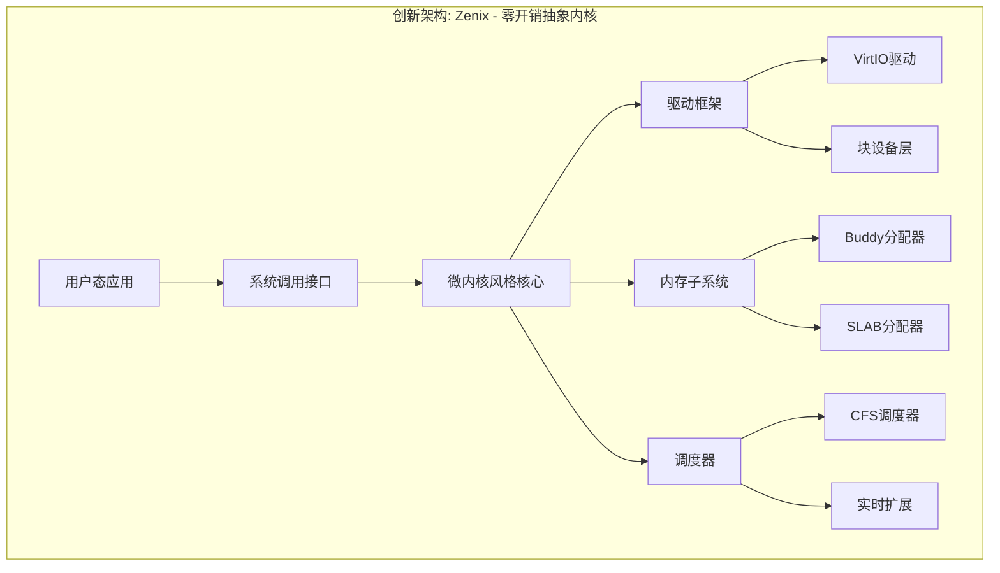

# 操作系统大赛 2026 - 创新开发计划 v2.0

> 基于 Nonix 获奖作品，全面升级架构，打造高竞争力参赛作品

---

## 一、项目现状分析

### 1.1 当前状态
- **代码量**: 仅完成最小可启动内核（Hello World 级别）
- **架构支持**: RISC-V64 + LoongArch64 双架构框架已搭建
- **构建系统**: Makefile + Cargo 可生成 `kernel-rv` 和 `kernel-la`
- **硬件抽象**: 尚未引入 polyhal，直接操作 UART 寄存器

### 1.2 与获奖作品的差距
| 模块 | 当前状态 | Nonix 状态 | 差距 |
|------|---------|-----------|------|
| 内存管理 | 无 | Buddy + 堆分配 + 页表 | 巨大 |
| 进程调度 | 无 | 多进程 + 抢占调度 | 巨大 |
| 文件系统 | 无 | EXT4 + VFS | 巨大 |
| 系统调用 | 无 | 60+ syscall | 巨大 |
| 设备驱动 | 无 | VirtIO-BLK/NET | 巨大 |
| 信号机制 | 无 | 完整信号支持 | 中等 |

---

## 二、评分标准深度解读

### 2.1 初赛成绩构成（满分 100）
```
初赛测例通过率: 50%
├── RISC-V64 虚拟平台: 25%
└── LoongArch64 虚拟平台: 25%

开发过程展示材料: 50%
├── 设计方案文档
├── 进展汇报幻灯片
├── 作品演示视频
└── >=8次提交记录（间隔3-7天，含详细注释）
```

### 2.2 决赛成绩构成（满分 100）
```
初赛阶段成绩: 20%
决赛阶段成绩: 80%
├── 初赛+决赛测例通过率: 15%（双架构虚拟平台）
├── 现场赛测例通过率: 40%（含物理硬件平台！）
├── 现场赛文档+提交记录: 5%
└── 现场答辩: 20%
```

### 2.3 关键洞察
1. **文档占 50% 权重** - 远超代码功能，必须重视
2. **提交记录有硬性要求** - 初赛 >=8次，决赛 >=4次，每次需有详细注释
3. **物理硬件平台占 20%** - 决赛必须适配 VisionFive2 和 2K1000LA
4. **现场赛新需求** - 决赛会公布新测试用例，内核需可扩展
5. **AI 工具使用需披露** - 必须在文档和 commit 中声明

---

## 三、创新技术架构设计

### 3.1 核心设计理念



### 3.2 五大技术创新点

#### 创新点 1: 自适应内存分配器 (Adaptive Allocator)
```
传统: 固定 Buddy + 固定 SLAB
创新: 运行时根据负载自动选择分配策略
- 小对象 (< 1KB): SLAB 池
- 中对象 (1KB-64KB): Buddy 系统
- 大对象 (> 64KB): 直接映射 + 延迟合并
- 实现 per-CPU 缓存，减少锁竞争
```

#### 创新点 2: 混合调度器 (Hybrid Scheduler)
```
基础: CFS (完全公平调度) 保证公平性
增强: 
- 实时任务支持 EDF (最早截止时间优先)
- IO 密集型任务自动提升优先级
- 多核负载均衡 (work stealing)
- 能耗感知调度 (大核/小核感知，为物理平台准备)
```

#### 创新点 3: 统一驱动框架 (Unified Driver Framework)
```
传统: 每个驱动独立实现
创新:
- 设备树 (Device Tree) 自动解析
- 驱动热插拔支持
- 统一的 DMA 映射接口
- 异步 IO 支持 (io_uring 风格)
```

#### 创新点 4: 智能文件系统缓存 (Smart FS Cache)
```
基础: LRU 页面缓存
创新:
- 预读算法: 基于访问模式的自适应预读
- 写回策略: 脏页批量写回 + 优先级队列
- 内存压力感知: 自动调整缓存大小
```

#### 创新点 5: 双架构零成本抽象 (Zero-Cost Dual Arch)
```
通过 Rust 泛型和条件编译实现:
- 90% 代码双架构共享
- 架构差异通过 trait 抽象
- 内联汇编封装，上层无感知
```

---

## 四、分阶段开发计划

### 第一阶段: 基础框架搭建（第1-2周）
**目标**: 可启动、可输出、有基本内存管理

```markdown
Week 1:
- [ ] 引入 polyhal 硬件抽象层
- [ ] 实现内核页表和虚拟内存映射
- [ ] 实现物理页帧分配器 (Buddy System)
- [ ] 实现内核堆分配器

Week 2:
- [ ] 实现 Trap/中断处理框架
- [ ] 实现定时器中断
- [ ] 实现基础上下文切换
- [ ] 实现串口驱动 (替代直接寄存器操作)
- [ ] **第1次提交**: 基础框架完成
```

### 第二阶段: 进程与调度（第3-4周）
**目标**: 多进程、抢占式调度、基础 syscall

```markdown
Week 3:
- [ ] 设计 TaskControlBlock 结构
- [ ] 实现进程创建/销毁
- [ ] 实现基础调度器 (Round-Robin)
- [ ] 实现 yield, exit, fork 等基础 syscall

Week 4:
- [ ] 实现抢占式调度 (时间片轮转)
- [ ] 实现进程间通信 (管道)
- [ ] 实现信号机制框架
- [ ] 升级调度器为 CFS
- [ ] **第2次提交**: 进程管理完成
```

### 第三阶段: 文件系统与驱动（第5-6周）
**目标**: EXT4 文件系统、VirtIO 设备

```markdown
Week 5:
- [ ] 实现 VirtIO-BLK 驱动 (MMIO + PCI)
- [ ] 集成 lwext4_rust 文件系统
- [ ] 实现 VFS 层 (文件、目录、挂载)
- [ ] 实现文件操作 syscall (open/read/write/close)

Week 6:
- [ ] 实现高级文件操作 (lseek, dup, fcntl)
- [ ] 实现目录操作 (mkdir, rmdir, getdents)
- [ ] 实现管道和重定向
- [ ] 实现 procfs (/proc/mounts 等)
- [ ] **第3次提交**: 文件系统完成
```

### 第四阶段: 系统调用完善（第7-8周）
**目标**: 通过大部分基础测试用例

```markdown
Week 7:
- [ ] 实现内存管理 syscall (mmap, munmap, mprotect, brk)
- [ ] 实现懒加载 (Lazy Loading)
- [ ] 实现写时复制 (COW)
- [ ] 实现 execve 和程序加载

Week 8:
- [ ] 实现高级进程管理 (wait4, exit_group, clone)
- [ ] 实现信号完整支持 (sigaction, sigprocmask, kill)
- [ ] 实现时间相关 syscall (nanosleep, clock_gettime)
- [ ] 实现其他基础 syscall (uname, getcwd, chdir)
- [ ] **第4次提交**: 核心 syscall 完成
```

### 第五阶段: 测试适配与优化（第9-10周）
**目标**: 通过初赛测试用例，性能优化

```markdown
Week 9:
- [ ] 适配测试脚本执行框架
- [ ] 扫描并执行磁盘测试点
- [ ] 按格式输出测试日志
- [ ] 修复测试用例发现的 bug

Week 10:
- [ ] 性能优化: 系统调用路径
- [ ] 性能优化: 内存分配
- [ ] 性能优化: 文件系统缓存
- [ ] 实现关机 syscall (shutdown)
- [ ] **第5次提交**: 测试适配完成
```

### 第六阶段: 双架构完善与文档（第11-12周）
**目标**: 双架构稳定运行，文档完善

```markdown
Week 11:
- [ ] LoongArch 架构全面测试
- [ ] 修复双架构差异导致的 bug
- [ ] 实现网络驱动 (VirtIO-NET，可选)
- [ ] 实现基础网络 syscall (socket, bind, listen)

Week 12:
- [ ] 完善设计方案文档
- [ ] 制作进展汇报幻灯片
- [ ] 录制作品演示视频
- [ ] 整理提交记录和开发日志
- [ ] **第6次提交**: 初赛最终版本
```

### 第七阶段: 决赛准备（第13-16周）
**目标**: 现场赛适配，物理硬件支持

```markdown
Week 13-14:
- [ ] 研究现场赛可能的新需求
- [ ] 实现自选创新功能
- [ ] 物理硬件平台适配 (VisionFive2)
- [ ] 物理硬件平台适配 (2K1000LA)

Week 15-16:
- [ ] 现场赛测试用例适配
- [ ] 最终性能调优
- [ ] 完善答辩材料
- [ ] **第7-8次提交**: 决赛版本迭代
```

---

## 五、技术选型与依赖

### 5.1 核心依赖
| 组件 | 选型 | 说明 |
|------|------|------|
| 硬件抽象 | polyhal | 多架构统一接口 |
| 文件系统 | lwext4_rust | EXT4 C 库 Rust 绑定 |
| 块设备 | virtio-drivers | VirtIO 设备驱动 |
| 日志 | log + custom backend | 内核日志系统 |
| 同步 | spin + custom mutex | 自旋锁 + 睡眠锁 |

### 5.2 自研核心模块
- `mm/`: 内存管理 (Buddy + SLAB + PageTable)
- `task/`: 进程调度 (CFS + EDF)
- `syscall/`: 系统调用 (60+ syscall)
- `drivers/`: 设备驱动框架
- `fs/`: 虚拟文件系统层

---

## 六、Git 提交策略

### 6.1 提交频率规划
```
第1次: 第2周末 - 基础框架完成
第2次: 第4周末 - 进程管理完成
第3次: 第6周末 - 文件系统完成
第4次: 第8周末 - 核心 syscall 完成
第5次: 第10周末 - 测试适配完成
第6次: 第12周末 - 初赛最终版本
第7次: 第14周末 - 决赛中期版本
第8次: 第16周末 - 决赛最终版本
```

### 6.2 Commit 规范
```
feat(mm): 实现 Buddy 系统物理页帧分配器

- 实现 2^0 到 2^11 共 12 个空闲链表
- 支持 alloc_frames 和 dealloc_frames 接口
- 通过双链表管理空闲块，合并时检查 buddy

fix(trap): 修复 RISC-V 异常返回时 sstatus 未恢复

docs: 更新内存管理设计文档

perf(fs): 优化 EXT4 目录查找，使用哈希缓存
```

---

## 七、文档与答辩策略

### 7.1 文档体系
```
docs/
├── 01-总体设计.md          # 架构设计、技术选型
├── 02-内存管理.md          # 详细设计、算法说明
├── 03-进程调度.md          # 调度算法、状态机
├── 04-文件系统.md          # VFS、EXT4 适配
├── 05-设备驱动.md          # VirtIO、驱动框架
├── 06-系统调用.md          # syscall 列表、实现细节
├── 07-双架构支持.md        # 架构差异、适配策略
├── 08-测试与优化.md        # 测试用例、性能数据
├── 09-AI工具使用声明.md    # AI 工具使用记录
└── 10-增量贡献说明.md      # 与基础版本的差异
```

### 7.2 答辩亮点展示
1. **现场演示**: 双架构同时编译、运行测试用例
2. **性能对比**: 与基础版本的性能提升数据
3. **创新展示**: 自适应分配器、混合调度器等
4. **代码质量**: Rust 内存安全保证、零 unsafe 代码比例

---

## 八、风险与应对

| 风险 | 影响 | 应对策略 |
|------|------|---------|
| 时间不足 | 高 | 优先保证测例通过，再优化性能 |
| LoongArch 资料少 | 中 | 提前研究 ByteOS 等参考实现 |
| 物理硬件调试难 | 高 | 提前申请设备，多利用 QEMU 模拟 |
| 测试用例变化 | 中 | 保持架构可扩展，模块化设计 |
| 团队分工问题 | 中 | 明确接口，每日同步进度 |

---

## 九、参考资源

### 9.1 往届优秀作品
- **Nonix**: 基础版本，文件系统、双架构支持
- **ByteOS**: LoongArch PCI 处理、网络栈
- **TrustOS**: 文件系统适配、工具模块

### 9.2 技术文档
- RISC-V Privileged Spec
- LoongArch Reference Manual
- VirtIO 1.2 Specification
- EXT4 Filesystem Specification

### 9.3 工具链
- Docker: `zhouzhouyi/os-contest:20260104`
- 测试用例: `oscomp/testsuits-for-oskernel`

---

## 十、总结

本计划的核心目标是：
1. **功能完整**: 通过所有初赛和决赛测试用例
2. **性能优秀**: 在关键路径上超越基础版本
3. **架构创新**: 5 大技术创新点体现设计水平
4. **文档完善**: 50% 的文档权重必须拿满
5. **过程规范**: 8+ 次提交，详细记录开发过程

**关键成功因素**: 
- 优先保证测例通过率（功能分）
- 重视文档和提交记录（过程分）
- 提前准备物理硬件适配（决赛分）
- 合理披露 AI 工具使用（合规性）
