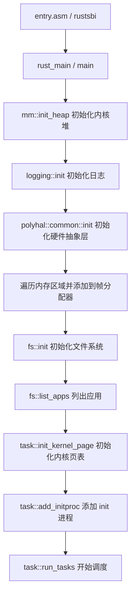

# 操作系统大赛 2026 - 基于 Nonix 获奖作品的开发指导计划

## 一、Nonix 获奖作品核心架构解析

### 1.1 项目整体结构

```
nonix-newtestloongarch/
├── Cargo.toml              # Workspace 配置，包含 os 和 user
├── Makefile                # 编译入口，支持 RISC-V 和 LoongArch 双架构
├── os/                     # 内核代码
│   ├── Cargo.toml          # 依赖 polyhal, lwext4_rust, virtio-drivers
│   ├── src/main.rs         # 内核入口，初始化流程
│   ├── src/config/         # 架构相关配置 (rv.rs / la.rs)
│   ├── src/drivers/        # 设备驱动 (VirtIO-BLK, VirtIO-NET)
│   ├── src/fs/             # 文件系统 (EXT4 适配层)
│   ├── src/mm/             # 内存管理
│   ├── src/task/           # 进程/线程管理
│   ├── src/trap/           # 中断/异常处理
│   ├── src/syscall/        # 系统调用实现
│   └── src/signal/         # 信号处理
├── user/                   # 用户态程序 (initproc, shell, tests)
├── lwext4_rust/            # EXT4 文件系统库 (C 库 Rust 绑定)
├── patch/                  # 第三方库补丁
│   ├── polyhal/            # 硬件抽象层 (多架构支持)
│   └── virtio-drivers/     # VirtIO 驱动补丁
└── bootloader/             # rustsbi 引导程序
```

### 1.2 关键技术选型

| 组件 | Nonix 选择 | 说明 |
|------|-----------|------|
| 开发语言 | Rust | 内存安全，适合 OS 开发 |
| 硬件抽象层 | polyhal | 支持多架构统一接口 |
| 文件系统 | lwext4_rust | C 库 lwext4 的 Rust 绑定 |
| 块设备 | virtio-drivers | 支持 MMIO (RISC-V) 和 PCI (LoongArch) |
| 启动方式 | rustsbi | RISC-V SBI 实现 |
| 构建工具 | Cargo + Makefile | Rust 编译 + 镜像生成 |

---

## 二、内核启动流程 (main.rs)



### 关键代码 (os/src/main.rs)

```rust
fn main(hartid: usize) {
    if hartid != 0 { return; }
    mm::init_heap();
    logging::init(option_env!("LOG"));
    polyhal::common::init(&PageAllocImpl);
    get_mem_areas().for_each(|(start, size)| {
        if *start != 0 {
            mm::add_frames_range(*start, start + size);
        }
    });
    fs::init();           // 初始化文件系统
    fs::list_apps();      // 列出应用
    task::init_kernel_page();
    task::add_initproc(); // 添加 init 进程
    task::run_tasks();    // 开始任务调度
}
```

---

## 三、双架构支持策略

### 3.1 架构差异处理

Nonix 通过 `polyhal` 实现双架构统一接口，关键差异点：

| 特性 | RISC-V | LoongArch |
|------|--------|-----------|
| VirtIO 传输 | MMIO (`MmioTransport`) | PCI (`PciTransport`) |
| 块设备地址 | `0x10001000` | 通过 PCI 枚举发现 |
| 链接脚本 | `linker_riscv64.lds` | `linker_loongarch64.lds` |
| 目标三元组 | `riscv64gc-unknown-none-elf` | `loongarch64-unknown-none` |

### 3.2 条件编译示例

```rust
// os/src/drivers/virtio_blk.rs
#[cfg(target_arch = "riscv64")]
pub use virtio_drivers::transport::mmio::{MmioTransport, VirtIOHeader};

#[cfg(target_arch = "loongarch64")]
pub use virtio_drivers::transport::pci::{...};

#[cfg(target_arch = "riscv64")]
const VIRTIO0: usize = 0x10001000;
```

---

## 四、文件系统实现 (EXT4)

### 4.1 架构分层

```
用户态 syscall (open/read/write/...)
    ↓
os/src/syscall/fs.rs
    ↓
os/src/fs/ (File trait, OSInode, FdTable)
    ↓
os/src/fs/ext4_lw/ (EXT4 适配层)
    ↓
lwext4_rust/ (C 库 Rust 绑定)
    ↓
C lwext4 库
    ↓
os/src/drivers/virtio_blk.rs (VirtIOBlock)
    ↓
QEMU virtio-blk 设备
```

### 4.2 关键文件

- `os/src/fs/ext4_lw/mod.rs`：超级块初始化，挂载根文件系统
- `os/src/fs/ext4_lw/inode.rs`：EXT4 inode 操作
- `os/src/fs/ext4_lw/sb.rs`：超级块操作
- `lwext4_rust/src/blockdev.rs`：块设备接口适配

### 4.3 初始化流程

```rust
// os/src/fs/mod.rs
pub fn init() {
    flush_preload();      // 将 initproc 写入 /test 文件
    create_init_file();   // 创建 /proc/mounts 等虚拟文件
}
```

---

## 五、系统调用实现

### 5.1 已实现的关键 syscall (os/src/syscall/mod.rs)

**文件操作：**
- `openat`, `close`, `read`, `write`, `readv`, `writev`, `pread64`
- `lseek`, `dup`, `dup3`, `fcntl`
- `mkdirat`, `unlinkat`, `linkat`, `renameat2`
- `getdents64`, `fstat`, `fstatat`, `statx`, `statfs`

**进程管理：**
- `clone`, `exec`, `exit`, `exit_group`, `wait4`
- `getpid`, `getppid`, `gettid`, `getuid`, `getgid`

**内存管理：**
- `brk`, `mmap`, `munmap`, `mprotect`

**信号：**
- `sigaction`, `sigprocmask`, `sigkill`, `sigreturn`

**其他：**
- `nanosleep`, `clock_gettime`, `gettimeofday`
- `uname`, `getcwd`, `chdir`, `pipe`, `splice`
- `shutdown`

### 5.2 syscall 分发框架

```rust
pub fn syscall(syscall_id: usize, args: [usize; 6]) -> SyscallRet {
    match syscall_id {
        SYSCALL_OPENAT => sys_openat(args[0] as isize, args[1] as *const u8, ...),
        SYSCALL_READ => sys_read(args[0], args[1] as *mut u8, args[2]),
        SYSCALL_WRITE => sys_write(args[0], args[1] as *mut u8, args[2]),
        SYSCALL_EXIT => sys_exit(args[0] as i32),
        // ... 更多 syscall
        _ => Err(SysErrNo::ENOSYS),
    }
}
```

---

## 六、内存管理设计

### 6.1 核心模块

- `mm/frame_allocator.rs`：物理页帧分配 (Buddy System)
- `mm/heap_allocator.rs`：内核堆分配
- `mm/memory_set.rs`：进程地址空间管理
- `mm/page_table.rs`：页表操作
- `mm/map_area.rs`：虚拟内存区域 (VMA) 管理

### 6.2 关键特性

- **懒加载 (Lazy Loading)**：`mmap` 时只分配 VMA，访问时触发 PageFault 才分配物理页
- **写时复制 (COW)**：`fork` 时共享页表，写入时复制
- **共享内存 (SHM)**：`shmget`/`shmat` 实现

---

## 七、进程/任务管理

### 7.1 核心结构

- `task/task.rs`：`TaskControlBlock` - 进程控制块
- `task/manager.rs`：任务管理器 (就绪队列)
- `task/processor.rs`：CPU 执行状态
- `task/context.rs`：任务上下文切换

### 7.2 进程状态

```rust
pub enum TaskStatus {
    Ready,
    Running,
    Zombie,
}
```

### 7.3 init 进程

```rust
lazy_static! {
    pub static ref INITPROC: Arc<TaskControlBlock> = Arc::new({
        let inode = open("/test", OpenFlags::O_RDONLY).unwrap().file().unwrap();
        let v = inode.inode.read_all().unwrap();
        TaskControlBlock::new(v.as_slice())
    });
}
```

---

## 八、中断与 Trap 处理

### 8.1 处理流程 (os/src/trap/mod.rs)

```rust
pub fn kernel_interrupt(ctx: &mut TrapFrame, trap_type: TrapType) {
    match trap_type {
        SysCall => {
            let result = syscall(ctx[TrapFrameArgs::SYSCALL], args);
            // 设置返回值...
        }
        StorePageFault(_) | LoadPageFault(_) => {
            // 尝试懒加载或 COW
            ok = task_inner.memory_set.lazy_page_fault(fault_vaddr, trap_type);
            if !ok {
                ok = task_inner.memory_set.cow_page_fault(fault_vaddr, trap_type);
            }
        }
        Timer => suspend_current_and_run_next(),
        // ...
    }
    handle_signals();
}
```

---

## 九、VirtIO 设备驱动

### 9.1 RISC-V (MMIO)

```rust
#[cfg(target_arch = "riscv64")]
unsafe {
    let virtio_header_addr = (VIRTIO0 | VIRT_ADDR_START) as *mut VirtIOHeader;
    let mmio_transport = MmioTransport::new(virtio_header_ptr).unwrap();
    let virtio_transport = VirtioTransportImpl::Mmio(mmio_transport);
    let virtio_blk = VirtIOBlk::new(virtio_transport).unwrap();
}
```

### 9.2 LoongArch (PCI)

```rust
#[cfg(target_arch = "loongarch64")]
unsafe {
    let mmconfig_base = (0x2000_0000usize | VIRT_ADDR_START) as *mut u8;
    let mut pci_root = PciRoot::new(MmioCam::new(mmconfig_base, Cam::Ecam));
    // 枚举 PCI 总线找到 VirtIO Block 设备
    // 设置 BAR 并创建 PCI Transport
}
```

---

## 十、Makefile 编译系统

### 10.1 关键目标

```makefile
all:
	@make ARCH=riscv64 build INIT=test LOG=OFF && cp target/.../os.bin ./kernel-rv
	@make ARCH=loongarch64 build INIT=test LOG=OFF && cp target/.../os ./kernel-la

build: env initproc $(KERNEL_BIN)

kernel:
	@cargo build --release --target $(TARGET)
```

### 10.2 编译产物

- `kernel-rv`：RISC-V ELF 格式内核
- `kernel-la`：LoongArch ELF 格式内核

---

## 十一、分阶段开发计划

### 第一阶段：环境搭建与 Hello World (第1-2周)

1. **Docker 环境配置**
   ```bash
   docker pull zhouzhouyi/os-contest:20260104
   ```

2. **GitLab 项目创建**
   - 项目名称：`OSKernel2026-X`
   - 设置为 private，阶段截止前公开

3. **Rust 工具链安装**
   ```bash
   rustup target add riscv64gc-unknown-none-elf
   rustup target add loongarch64-unknown-none
   rustup component add rust-src llvm-tools-preview
   ```

4. **最小可运行内核**
   - 基于 `polyhal` 创建可启动内核
   - 实现串口输出 `Hello, OS!`
   - 确保 `make all` 能生成 `kernel-rv` 和 `kernel-la`

### 第二阶段：基础内核功能 (第3-4周)

1. **内存管理**
   - 实现页帧分配器 (Buddy System)
   - 实现内核堆分配
   - 实现页表管理 (SV39 for RISC-V)

2. **Trap/中断处理**
   - 实现异常入口
   - 实现定时器中断
   - 实现 syscall 入口框架

3. **任务调度**
   - 实现任务控制块 (TCB)
   - 实现协作式/抢占式调度
   - 实现 `yield`, `exit` 等基础 syscall

### 第三阶段：文件系统与设备驱动 (第5-6周)

1. **VirtIO-BLK 驱动**
   - RISC-V：MMIO 方式
   - LoongArch：PCI 枚举方式
   - 实现块设备读写接口

2. **EXT4 文件系统集成**
   - 集成 `lwext4_rust` 或自行实现
   - 实现文件系统挂载
   - 实现 `open`, `read`, `write`, `close`

3. **虚拟文件系统**
   - 实现 `/proc/mounts`
   - 实现管道 (`pipe`)

### 第四阶段：系统调用完善 (第7-8周)

1. **进程管理 syscall**
   - `clone`, `exec`, `wait4`, `exit_group`
   - 进程父子关系、僵尸进程处理

2. **内存管理 syscall**
   - `mmap`, `munmap`, `mprotect`, `brk`
   - 懒加载、写时复制

3. **文件系统 syscall**
   - `openat`, `getdents64`, `lseek`, `dup`, `fcntl`
   - `mkdirat`, `unlinkat`, `linkat`

### 第五阶段：测试适配与优化 (第9-10周)

1. **测试脚本支持**
   - 扫描磁盘上的 `xxxxx_testcode.sh`
   - 串行执行测试点
   - 按格式输出 `#### OS COMP TEST GROUP START/END ####`

2. **信号支持**
   - `sigaction`, `sigprocmask`, `kill`
   - 用户态信号处理

3. **网络支持 (可选)**
   - VirtIO-NET 驱动
   - 基础 socket syscall

### 第六阶段：双架构适配与最终测试 (第11-12周)

1. **LoongArch 适配**
   - 确保所有代码通过条件编译支持双架构
   - PCI 设备枚举调试
   - 链接脚本调整

2. **性能优化**
   - 减少系统调用开销
   - 优化内存分配
   - 优化文件系统缓存

3. **最终测试**
   - 使用官方测试用例完整测试
   - 确保 `shutdown` 正常退出 QEMU
   - 代码审查与清理

---

## 十二、关键技术实现建议

### 12.1 推荐参考仓库

1. **TrustOS**：文件系统适配、utils 模块
2. **rcore-tutorial-v3-with-hal-component**：polyhal 多架构适配示例
3. **ByteOS**：LoongArch PCI 总线处理

### 12.2 开发技巧

1. **使用 polyhal 简化多架构适配**
   - 统一接口：`PhysAddr`, `VirtAddr`, `PageAlloc`
   - 条件编译处理架构差异

2. **EXT4 文件系统**
   - 推荐使用 `lwext4_rust` (C 库绑定)
   - 需要实现 `KernelDevOp` trait 对接块设备

3. **测试调试**
   - 使用 `LOG=trace` 开启详细日志
   - QEMU 调试：`qemu-system-riscv64 -s -S` + GDB

4. **避免常见问题**
   - 不要提交二进制文件（除了引导程序）
   - 隐藏目录（如 `.cargo`）需改名提交
   - 确保 `make all` 在干净环境可编译

